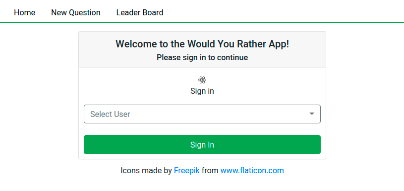

# udacity-react-would_you_rather

A super simple voting front-end made with ReactJS.

This project was bootstrapped with [Create React App](https://github.com/facebook/create-react-app).

## How To Run

Go to the root directory (where this README file is) from your command prompt/terminal, then:

1. Install all required modules: `npm i`
2. Run the app: `npm start`

## Screenshots

### 1. Login page

### 2. Homepage

### 3. Login page

### 4. Poll Result page

### 5. Polling page

### 6. Leaderboard page

## Notes

1. React hooks are used instead of component classes. Some notable differences:
  - [`useSelector`](https://react-redux.js.org/api/hooks#useselector-examples) replaces mapStateToProps + connect.
  - `useEffect(func, [])` instead of `componentDidMount()`.
  - `useState()` for each state instead of initializing states in the class.
  - `useDispatch()` instead of passing around a `dispatch()` function in `props`.
2. `PageNotFound` component is presented when the user navigates to a non-existent page and question.
3. The `Login` component supports going to the destination page right after login.

This is no longer relevant since we are redirecting to homepage as required by the specification:
1. The `NewQuestion` component has a feature to wait until the page completed loading before then opening the newly created question. To do this, I created a redux store entry "newQuestionId" that gets filled right after the creation.

  The `NewQuestion` component then redirects to `QuestionPoll` page (the question detail page) when this redux store existed, and the `QuestionPoll` page deletes "newQuestionId" when the component mounted. This is a workaround since `react-router-dom` v5 does not support redirecting from actions.